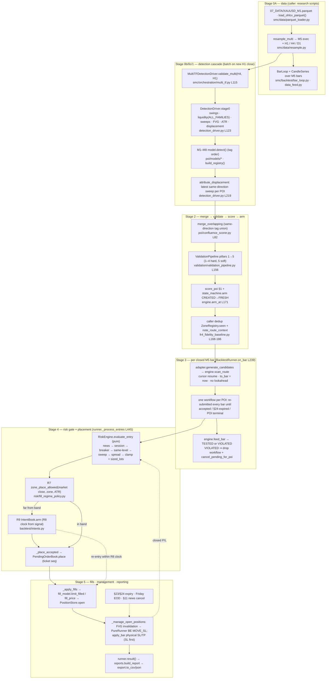
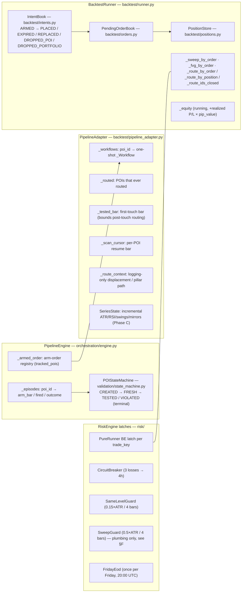

# AS-CODED ARCHITECTURE — FLOWCHART + PICTURES (Part 1)

**Task:** Local-agent extraction of the architecture THE CODE ACTUALLY IMPLEMENTS under `04_SRC/smc/`, derived from source only.
**Date:** 2026-09-23. **Scope:** read-only audit — **no strategy code, thresholds, or locked_constants were changed**.
**Comparison vs Rev 5 intended flowchart:** deliberately NOT started here (Part 2 + 3 are Lead Architect + dual sessions).

---

## 0. Method and evidence rules

* Every claim below cites a file (and line where useful). Claims that could not be traced to code are in §G and labelled.
* The inventory was produced by an AST scan (`06_RESEARCH/scripts/build_module_inventory.py`) over
  `04_SRC/smc/**/*.py` (118 modules) with **import references** resolved across `04_SRC/smc`, `04_SRC/tests`, `06_RESEARCH`.
* Raw scan output: `06_RESEARCH/results/architecture_audit/module_inventory.json`.
* "Shipped chain" means the research scripts that produced the accepted baselines and the latest smoke:
  `06_RESEARCH/scripts/fr4_fidelity_baseline.py` (FR-4b window) and `06_RESEARCH/scripts/r9_place_on_reentry_smoke.py`
  (R9 smoke; imports the FR-4 namespace). Where the smc package itself does not contain the driver, that is stated.
* No file in `04_SRC/` was modified by this task (verified at the end; suite unchanged).

### Headline as-coded facts (full evidence in §B–§F)

1. **Two different drivers exist for the same detection stack.** The shipped research chain drives detection through
   `MultiTFDetectionDriver` (H4 + H1 detection, M5 execution); the live/paper loop drives **single-TF** `DetectionDriver`
   on the execution window (`smc/live/loop.py` imports only `DetectionDriver`).
2. **Detection is batch, execution is per-bar.** HTF batches refresh when the caller sees a **new H1 close**
   (`fr4_fidelity_baseline.py` `Cycle.on_bar`); the M5 runner runs its full bar order every closed M5 bar.
3. **Entry is a limit order on every path.** `TriggerSignal.entry_price` → pending LIMIT; no trigger emits a market order
   (`triggers/base_trigger.py` docstring; R7/R9 keep the same limit).
4. **Placement is risk-then-placement:** the pure `RiskEngine.evaluate_entry` decides; the runner mutates the
   `PendingOrderBook` only on `RiskAction.ENTER`; the R7 guard can defer placement into an R9 intent.

---

## A. Package tree — one-line role per module (from docstrings/AST, not memory)

#### smc/(package root)/
- `smc` — SMC Bot — Python-First core package. · classes: —
- `backtest` — Phase 6: Backtesting — event-driven engine + walk-forward/Monte Carlo. · classes: —
- `config` — Configuration: frozen thresholds and core enums (Phase 0). · classes: —
- `core` — Core domain types: candles, swings, zones, liquidity levels, POIs, events. · classes: —
- `data` — Data access layer: direct MT5 API wrapper + CSV loader (Phase 0). · classes: —
- `detection` — Phase 1: Core Detection — Stage 0A/0b/0c detectors. · classes: —
- `execution` — Phase 4: Execution — order/position management via the MT5 API. · classes: —
- `live` — Phase 7 — Live: main loop, heartbeat publisher, watchdog integration. · classes: —
- `logging` — Phase 5: Logging — forensic (41-column) and ML feature loggers. · classes: —
- `orchestration` — Phase 4: orchestration glue — Detection → POI → Validation → Trigger → Execution. · classes: —
- `paper` — Phase 6 M6 — Paper Trading: runner, broker adapter, KPI logging. · classes: —
- `poi` — Phase 2: POI Classification — M1–M8 modular tags, confluence, CHOCH. · classes: —
- `risk` — Phase 5: Risk Layer — port of v25_DIAG defensive components. · classes: —
- `triggers` — Phase 4: LTF Triggers A–F + chronological routing + §24 expiry. · classes: —
- `utils` — Shared utilities: ATR, UTC/session timestamps, XAUUSD pip helpers. · classes: —
- `validation` — Phase 3: 5-Pillar Validation — refinement, displacement, P/D, freshness, inducement. · classes: —

#### smc/backtest/
- `bar_loop` — Thin bar-driven loop (Phase 6, Milestone 1). · classes: BarHandler, BarLoop, LoopStats, RecordingHandler
- `clock` — Deterministic backtest clock (Phase 6, Milestone 1). · classes: BarClock, ClockNotSetError
- `data_feed` — Backtest data feed — historical candle access (Phase 6, Milestone 1). · classes: CandleSeries, MultiTimeframeFeed
- `export` — Phase 6 M5 — CSV / JSON export helpers (pure serialization). · classes: —
- `fill_model` — Pure fill model (Phase 6, Milestone 2). · classes: BarClose, CloseKind
- `intents` — R9 place-on-reentry intents (Lead Architect ruling, 2026-09-22). · classes: IntentBook, PlaceIntent
- `orders` — Backtest pending order book (Phase 6, Milestone 2). · classes: PendingOrder, PendingOrderBook
- `pipeline_adapter` — Phase 6 M4 — pipeline adapter: real detection inside the backtest bar loop. · classes: PipelineAdapter, _Workflow
- `pipeline_bridge` — Phase 6 M4 — Pipeline → backtest bridge (real detection → risk → orders). · classes: —
- `positions` — Backtest open-position store (Phase 6, Milestone 2). · classes: BacktestPosition, ClosedPosition, PositionStore
- `reports` — Phase 6 M5 — core reports: a pure projection over completed run data. · classes: BacktestReport, CoreMetrics, GroupMetrics, TradeRecord
- `runner` — Backtest runner — RiskEngine integration (Phase 6, Milestone 3). · classes: BacktestRunner, BlockedEntry, CandidateEntry, RunnerConfig, RunnerResult
- `series_state` — Incremental full-prefix series state (Phase C perf patch — exact). · classes: SeriesState, SwingIndex, _SpaceIndex

#### smc/config/
- `locked_constants` — Frozen thresholds — single source of truth. · classes: —
- `model_type` — ModelType enum — the 8 equal POI tags (LOCKED_DECISIONS §1). · classes: ModelType
- `timeframe` — Timeframe enum — values match MetaTrader5 ``TIMEFRAME_*`` constants. · classes: Timeframe

#### smc/core/
- `candle` — Candle dataclass — OHLCV bar with timestamp and timeframe. · classes: Candle
- `enums` — Core enums: TriggerType, LiquidityType, POIState, Direction, PoolType. · classes: Direction, LiquidityType, POIState, PoolType, TriggerType
- `event` — Event dataclass — the shared event envelope for the pipeline/backtest bus. · classes: Event
- `liquidity_level` — LiquidityLevel dataclass — one of the 8 Stage 0A liquidity level types. · classes: LiquidityLevel
- `poi` — POI dataclass — zone + equal-weight model tags + freshness/quality state. · classes: POI
- `swing` — Swing dataclass — structural swing with Base Candle validity gate. · classes: Swing
- `zone` — Zone dataclass — price zone with direction and timeframe. · classes: Zone

#### smc/data/
- `csv_loader` — CSV loader — historical OHLCV into ``list[Candle]`` (stdlib only). · classes: —
- `mt5_connector` — Thin wrapper around the MetaTrader5 Python package (direct, no HTTP). · classes: MT5Connector, MT5NotAvailableError
- `parquet_loader` — Parquet loader — canonical historical OHLCV into ``list[Candle]``. · classes: —
- `resample` — Deterministic M1 → higher-timeframe OHLCV resampling (FR-1). · classes: —

#### smc/detection/
- `base_candle` — Base Candle identification algorithm (LOCKED_DECISIONS §18). · classes: —
- `displacement_checker` — Displacement check (LOCKED_DECISIONS §3). · classes: DisplacementResult
- `eqh_eql_detector` — Equal Highs / Equal Lows detection (LOCKED_DECISIONS §2, §8). · classes: —
- `fvg_detector` — Fair Value Gap (FVG) detection — 3-candle imbalance (LOCKED_DECISIONS §3). · classes: FVG
- `liquidity_scanner` — Liquidity scanner — Stage 0A orchestrator (LOCKED_DECISIONS §2). · classes: —
- `periodic_levels` — Periodic levels — PDH/PDL and PWH/PWL (LOCKED_DECISIONS §2). · classes: —
- `session_levels` — Session high/low levels (LOCKED_DECISIONS §2). · classes: —
- `structural_swing_detector` — Structural swing detection (LOCKED_DECISIONS §27 + §18 + §19). · classes: —
- `sweep_detector` — Liquidity sweep detection (LOCKED_DECISIONS §2, sweep principles). · classes: SweepResult
- `swing_validator` — Swing validity decision gate (LOCKED_DECISIONS §19). · classes: SwingValidation

#### smc/execution/
- `lot_sizing` — Dynamic risk lot sizing (v25_DIAG formula, ported to Python). · classes: —
- `news_guard` — News protocol — high-impact event guard (LOCKED_DECISIONS §11 — frozen). · classes: NewsEvent
- `order_manager` — Order placement / cancel via the MT5 connector (Phase 4, Stage 4). · classes: OrderKind, OrderManager, OrderRequest, OrderResult
- `position_manager` — Position monitoring + SL/TP management (Phase 4, Stage 4). · classes: PositionManager, PositionSnapshot
- `session_filter` — Session filter — trading-session gate (LOCKED_DECISIONS §2). · classes: —

#### smc/live/
- `config` — Phase 7 — live configuration (demo-first posture). · classes: LiveConfig
- `heartbeat` — Phase 7 — heartbeat publisher + watchdog decision (live readiness). · classes: HeartbeatPublisher, HeartbeatRecord, WatchdogDecision
- `loop` — Phase 7 — live main loop: connector → detection → paper/live cycle + heartbeat. · classes: LiveLoop
- `operator_config` — Phase D operator pack — external mutable config (strict whitelist). · classes: ConfigError, OperatorConfig
- `operator_console` — Phase D operator pack — live console status board (pure renderer). · classes: —
- `run_operator` — Phase D operator pack — live operator entrypoint (demo/paper run surface). · classes: OperatorSession

#### smc/orchestration/
- `detection_driver` — Coherence patch (CR1) — detection driver: raw candles → validated/armed POIs. · classes: DetectionDriver, DetectionRun, DriverResult
- `engine` — PipelineEngine — the Phase 4 integration seam (Stage 2 → 3 → 4). · classes: ExecutionOutcome, PipelineEngine, _PoiEpisode
- `multi_tf` — Multi-timeframe detection cascade (FR-1). · classes: MultiTFDetectionDriver, MultiTFDriverResult, PerTFResult

#### smc/paper/
- `broker_adapter` — Phase 6 M6 — broker adapter: the thin live/paper boundary. · classes: BrokerAdapter, ModifyOutcome, PlaceOutcome
- `kpi_logger` — Phase 6 M6 — operational KPI logging for the paper runner. · classes: KPILogger, KpiRecord
- `runner` — Phase 6 M6 — paper runner: the shared stack against a demo broker. · classes: PaperConfig, PaperRunner, _TrackedPending, _TrackedPosition

#### smc/poi/
- `base_model` — Abstract POI model base + shared detection geometry helpers. · classes: POIModel
- `choch_classifier` — CHOCH Rule 1/2/3 classifier (LOCKED_DECISIONS §17, §20). · classes: ChochBreak, ChochRule
- `confluence_scorer` — Confluence scorer (LOCKED_DECISIONS §1, §21/§26). · classes: ConfluenceScore, ConfluenceTier
- `deal_range` — Dealing range + premium/discount classification (LOCKED_DECISIONS §6, R1 §3.4). · classes: DealRangeRegion, DealingRange
- `model_registry` — Model registry — maps ModelType to POIModel instances. · classes: ModelRegistry
- `models` — The eight equal POI model detectors (M1–M8). · classes: —
- `models.m1_origin_base` — Model 1 — Origin Demand / Supply Base (R1 §5, LOCKED_DECISIONS §1). · classes: M1OriginBase
- `models.m2_rbs_sbr_breaker` — Model 2 — RBS / SBR Breaker Flip (R1 §5, LOCKED_DECISIONS §1). · classes: M2RbsSbrBreaker
- `models.m3_choch_retest` — Model 3 — CHOCH Baseline Retest (R1 §5, LOCKED_DECISIONS §9/§17/§20). · classes: M3ChochRetest
- `models.m4_quasimodo` — Model 4 — Quasimodo Level / QML (R1 §5, LOCKED_DECISIONS §14). · classes: M4Quasimodo
- `models.m5_extreme_equal_highs` — Model 5 — Extreme Equal Highs / Supply Origin (R1 §5, LOCKED_DECISIONS §8). · classes: M5ExtremeEqualHighs
- `models.m6_neckline_retest` — Model 6 — Neckline / Double Top-Bottom Retest (R1 §5). · classes: M6NecklineRetest
- `models.m7_equal_resistance` — Model 7 — Equal Resistance Shelf Retest (R1 §5, LOCKED_DECISIONS §8). · classes: M7EqualResistance
- `models.m8_htf_demand_supply` — Model 8 — HTF Demand/Supply zones, D1/H4 (R1 §5, LOCKED_DECISIONS §21/§22/§26). · classes: M8HtfDemandSupply

#### smc/risk/
- `circuit_breaker` — Phase 5 — circuit breaker (v25_DIAG ``TradeAllowed`` / consecutive-loss · classes: CircuitBreaker, CircuitBreakerState
- `fill_regime_policy` — FR fill-regime policy (Lead Architect rulings R7 + R8, 2026-09-22). · classes: —
- `friday_eod` — Phase 5 — Friday EOD guard (v25_DIAG ``CheckFridayClose``, ported to · classes: FridayEod, FridayEodState
- `fvg_invalidation` — Phase 5 — FVG structural invalidation (v25_DIAG v22 "Step 3 — FVG · classes: FvgContext
- `lot_sizing` — Phase 5 — risk lot sizing policy (v25_DIAG formula + frozen §28.7 band/cap). · classes: —
- `pure_runner` — Phase 5 — PureRunner (v25_DIAG BE-at-ATR logic, ported to Python). · classes: PureRunner, PureRunnerState
- `risk_engine` — Phase 5 — risk engine orchestrator (v25_DIAG entry gates + exit management · classes: EntryDecision, EntryRequest, ExitDecision, PositionState, RiskAction, RiskEngine
- `same_level_guard` — Phase 5 — same-level SL re-entry guard (v25_DIAG v23 "Same-SL Block", · classes: SameLevelGuard, SameLevelGuardState
- `spread_grading` — Phase 5 — spread grading (v25_DIAG v19.7 "Setup Grading A+/A/B/C", ported · classes: SpreadGrade
- `sweep_guard` — Phase 5 — failed-sweep re-entry guard (v25_DIAG ``IsFailedSweepBlocked``, · classes: SweepGuard, SweepGuardState

#### smc/triggers/
- `base_trigger` — Trigger contract + shared signal/context types (Phase 4, LOCKED §12/§22–§24). · classes: Trigger, TriggerContext, TriggerSignal
- `compatibility_matrix` — POI × Trigger compatibility matrix (LOCKED_DECISIONS §15 / R1 §8 — frozen). · classes: CompatibilityGrade, CompatibilityMatrix
- `trigger_a_choch` — Trigger A — M1/M5 CHOCH Reversal (LOCKED §9/§12, R1 §7 Trigger A). · classes: ChochReversalTrigger
- `trigger_b_leading_diagonal` — Trigger B — Leading Diagonal (5-wave initiation) (R1 §7 Trigger B). · classes: LeadingDiagonalTrigger
- `trigger_c_ending_diagonal` — Trigger C — Ending Diagonal Wave-5 Throw-Under/Over (R1 §7 Trigger C). · classes: EndingDiagonalTrigger
- `trigger_d_two_bar` — Trigger D — Two-Bar Reversal (LOCKED §10/§24, R1 §7 Trigger D). · classes: TwoBarReversalTrigger
- `trigger_e_rsi_divergence` — Trigger E — Double Top/Bottom + RSI Divergence (R1 §7 Trigger E). · classes: RsiDivergenceTrigger, _DoublePattern
- `trigger_expiry` — Trigger validity / expiry (LOCKED_DECISIONS §23 + §24 — frozen). · classes: —
- `trigger_f_bos_ob` — Trigger F — BOS + OB Continuation (R1 §7 Trigger F, LOCKED §24). · classes: BosObContinuationTrigger
- `trigger_router` — Trigger routing — chronological first-valid wins (LOCKED §12, R1 §11). · classes: TriggerRoute, TriggerRouter
- `wave_structure` — Deterministic V1 wave-structure extraction for Trigger B/C. · classes: Diagonal, Impulse, WaveExtreme

#### smc/utils/
- `atr` — ATR (Average True Range) — Wilder smoothing, stdlib only. · classes: —
- `pips` — XAUUSD pip helpers. · classes: —
- `rsi` — RSI (Relative Strength Index) — Wilder smoothing, stdlib only. · classes: —
- `timestamps` — UTC conversion and session detection (Asia / London / NY). · classes: Session

#### smc/validation/
- `pillar` — Pillar contract + shared result/context types (Phase 3, R1 §6). · classes: Pillar, PillarResult, PillarStatus, ValidationContext
- `pillar_1_zone_refinement` — Pillar 1 — Zone Refinement (§13, R1 §6 Pillar 1). · classes: ZoneRefinementPillar
- `pillar_2_displacement` — Pillar 2 — Displacement (§3, R1 §6 Pillar 2). · classes: DisplacementPillar
- `pillar_3_premium_discount` — Pillar 3 — Premium / Discount (§6, R1 §6 Pillar 3). · classes: PremiumDiscountPillar
- `pillar_4_freshness` — Pillar 4 — Freshness (§5, R1 §6 Pillar 4). · classes: FreshnessPillar
- `pillar_5_inducement` — Pillar 5 — Inducement (§7, R1 §6 Pillar 5). · classes: InducementPillar
- `state_machine` — POI freshness state machine (LOCKED_DECISIONS §5, §23). · classes: IllegalTransitionError, POIStateMachine
- `validation_pipeline` — Validation pipeline — runs the five pillars 1→5 for one POI (R1 §6, §10). · classes: ValidationDecision, ValidationPipeline, ValidationResult
- `window_cache` — Per-detection-window artifact cache (Phase C perf patch — exact). · classes: WindowCache

---

## B. Stage map — stage label → actual files / classes / functions

Stage labels 0A/0b/0c/1/1b/2/3/4/5 are the project's labels (the `smc/detection/` package docstring itself says
"Stage 0A/0b/0c detectors"). The mapping below is to **code as it exists**, including where a stage has no
in-package owner.

| Stage | What the label means in-code | As-coded owner (file · symbol) | Notes from code |
|---|---|---|---|
| **0A** data | load + resample + bar feed | `data/parquet_loader.load_ohlcv_parquet`, `data/resample.resample_multi`, `backtest/data_feed.CandleSeries`, `backtest/bar_loop.BarLoop` | All between callers (research scripts) and the smc runners; `resample_multi` produces M5 exec + H1/H4/D1 |
| **0b** HTF cadence | when HTF detection runs | **caller-level**: `06_RESEARCH/scripts/fr4_fidelity_baseline.py` `Cycle.on_bar` (bisect on H1 timestamps → new H1 close → batch) | No smc module owns the cadence; `MultiTFDetectionDriver.validate_multi` is the batch seam it calls |
| **0c** raw detectors | swings, liquidity, sweeps, FVG, ATR, displacement | `orchestration/detection_driver.DetectionDriver.stage0` (L123) → `detect_swings`, `liquidity_scanner.scan(ALL_FAMILIES)`, `sweep_detector.detect_sweeps`, `fvg_detector.detect_fvgs`, `utils/atr.atr_series`, `displacement_checker.check_displacement` | FVG list + ATR series computed once per window and shared (Phase C perf) — value-identical to per-sweep recomputation |
| **1** POI models | M1–M8 detection | `DetectionDriver.detect_pois` (L198) → `poi/model_registry.build_registry().all()` → each `model.detect(candles, swings, levels)` | A raising model is **skipped and recorded** (`skipped_models`), never fatal |
| **1b** displacement injection | per-POI displacement for Pillar 2 | `DetectionDriver.attribute_displacement` (L219) — most recent same-direction sweep's `DisplacementResult`; absent → no map entry | Absent entry ⇒ Pillar 2 UNAVAILABLE ⇒ hard reject (fail-fast, `validation_pipeline.py`) |
| **2** merge + validate + score + arm | POI → tradeable POI | `PipelineEngine.merge` → `poi/confluence_scorer.merge_overlapping`; `PipelineEngine.validate` (L147) → `ValidationPipeline.run` (L156, pillars 1–5; 1–4 hard, 5 soft); `_assign_quality_score` (`score_poi`, §1); `arm_at` (L171) → `POIStateMachine.arm` | `poi.state` mirrors the machine; TESTED/VIOLATED terminal |
| **3** arm bookkeeping + scan | per-bar trigger search | `PipelineEngine.arm_at`/`episode`/`tracked_pois`; `PipelineAdapter.generate_candidates` (L137) → `engine.scan_route` (L243) → `TriggerRouter.scan` (L144) | Scan cap `to_bar=bar_index` (no lookahead) + `scan_from` cursor resume; deadline = `arm_bar + poi_give_up_bars()` |
| **3 (state feed)** | §5 freshness per bar | `PipelineEngine.feed_bar` → `POIStateMachine.touches_zone / on_touch / on_violation` | Runs AFTER the scan (touch bar must stay routable); VIOLATED ⇒ workflow dropped + `cancel_pending_for_poi` |
| **4** risk + placement | gate, size, place | `BacktestRunner._process_entries` (L445) → `RiskEngine.evaluate_entry` (L197) → R7 `zone_place_allowed` → `IntentBook.arm` OR `_place_accepted` (L516) → `PendingOrderBook.place` | Blocked and R7-skipped candidates consume **nothing**; one-shot burns only in `_notify_candidate_accepted` |
| **5** fills, management, reporting | fills, exits, expiry, reports | `_apply_fills` (L395) → `fill_model.limit_filled/fill_price` → `PositionStore.open`; `positions.apply_bar` (physical SL/TP, SL first); `_manage_open_positions` (L353) → `RiskEngine.evaluate_exit` (L269, FVG invalidation → PureRunner BE); `_expire_orders` (L332); `_record_close` (L709); `result()` (L657) → `reports.build_report` → `export.to_csv/to_json` | Same-bar sequencing: risk exits before physical SL/TP; BE moves applied only when they improve the stop |

**Stages with no in-package owner (as coded):** 0b cadence (§B row), M8 HTF series map assembly outside the driver
(`MultiTFDetectionDriver` shares D1/H4 into the M8 map only when the caller supplies them), and the caller-side
**zone dedup** (`ZoneRegistry.seen`) that prevents an HTF zone from arming twice across successive batches.

---

## C. Mermaid — end-to-end runtime AS CODED



**Books and their owners — as coded**



---

## D. Call-graph notes — who calls detect → merge → validate → arm → scan → place

**Detection batch (per new H1 close, shipped chain):**

```
Cycle.on_bar (fr4_fidelity_baseline.py L207)
  ├─ prefixes built by bisect over H1/H4/D1 timestamps (no future bars)
  ├─ MultiTFDetectionDriver.validate_multi(prefixes, engine=engine, return_details=True)   # multi_tf.py L115
  │    └─ per TF: DetectionDriver.validate_window()                                        # detection_driver.py L245
  │         ├─ stage0(candles) → DetectionRun(swings, levels, sweeps, displacements, fvgs, atr)
  │         ├─ detect_pois() → raw POIs (+ skipped_models)
  │         ├─ attribute_displacement() → {poi_id: DisplacementResult}
  │         └─ PipelineEngine.validate(...)                                                # engine.py L147
  │              ├─ merge_overlapping()                                                    # confluence_scorer L82
  │              ├─ ValidationPipeline.validate → run (pillars 1–5)                         # validation_pipeline.py L120/L156
  │              └─ _assign_quality_score → score_poi + state_machine.arm
  ├─ details[tf] → per-POI ValidationResult → pillar_path_summary (log string)             # pipeline_bridge L30
  ├─ ZoneRegistry.seen(poi.zone) dedup → adapter.note_route_context(poi.id, …)
  └─ engine.arm_at(poi, arm_bar=current M5 bar index)                                       # engine.py L171
```

**Per-bar execution (every closed M5 bar):**

```
BarLoop.run → BacktestRunner.on_bar(bar, bar_index, clock)                                  # runner.py L239
  ├─ (3b) adapter.current_atr(bar_index) → set_atr   [+ config.spread_price]
  ├─ (3c) orders.expired_by_section23 / expired_by_give_up → adapter.notify_order_expired → machine.expire_unfilled
  ├─ (3c-i) intents.expire_due(bar_index)
  ├─ (4) RiskEngine.evaluate_exit per position (FVG invalidation → PureRunner BE)
  ├─ (5) _apply_fills (limit_filled/fill_price) → PositionStore.open → risk.on_trade_opened
  ├─ (5b) positions.apply_bar (SL/TP, SL first) → _record_close
  ├─ (6) adapter.generate_candidates(bar, bar_index, now)                                   # pipeline_adapter L137
  │       per tracked POI (arm order):
  │         ├─ §24 backstop: bar > arm_bar + poi_give_up_bars() → retire scan
  │         ├─ may route? FRESH or TESTED within [first-touch bar, +1]                      # _may_route
  │         ├─ engine.scan_route(poi, state.candles, state.swings, to_bar=now,
  │         │                    scan_from=cursor, evaluation_* / hints=state)               # engine L243 → router.scan L144
  │         │      └─ TriggerRouter.evaluate_at: matrix-eligible A–F; first fire wins;
  │         │         same-bar tie = higher §15 grade, then earlier letter
  │         ├─ route found → candidate_from_route(route, disp, pillar_path, atr)             # pipeline_bridge
  │         │      → runner.submit_entry(candidate)   [workflow created, one per POI]
  │         ├─ workflow live → signal_expired? else re-submit for THIS bar's verdict
  │         └─ engine.feed_bar(poi, bar) → TESTED (record) / VIOLATED (drop + cancel)
  ├─ (6) _process_entries: risk.evaluate_entry → R7 zone_place_allowed
  │        ├─ blocked (any gate) → blocked_log only; workflow survives
  │        ├─ R7 far → blocked_log(skip_place_far_from_zone) + intents.arm(candidate, lots, bar, R8)
  │        └─ else → _place_accepted → orders.place() + context maps + on_candidate_accepted
  ├─ (7) _place_due_intents: remaining ≥ 3 AND (band re-entry on close OR limit touch on range)
  │        → _place_accepted(rest_bars=remaining) → intents.mark_placed
  └─ (7b) adapter.prune_terminal_pois(retain = order/position POI ids, bar_index)
```

**Asymmetry worth recording:** `PipelineEngine.execute_route` (the engine's own route→order helper)
is **not called by any runner** — its docstring says so and no runner imports it; placement is always
the runner's `_place_accepted` (backtest) or `PaperRunner._entry_step` (paper).

---

## E. Config defaults that shape behavior as coded

`RunnerConfig` (`backtest/runner.py` L137): `equity=10_000.0`, `risk_fraction=0.01`, `pip_value_per_lot=10.0`,
`min_lots=0.01`, `lot_step=0.01`, `allowed_sessions=None`, `news_events=[]`, `timeframe=M5`, `spread_price=0.0`.

* `allowed_sessions=None` at runner level means **no session gate** (the `RiskEngine` skips the check);
  the shipped research configs pass `(ASIA, LONDON, NEW_YORK)` = one combined 00:00–20:00 UTC window.
* `news_events=[]` in every shipped run config (grep: `fr4_fidelity_baseline.py L160`, `fr4_armed_poi_fate.py L288`,
  `phase_b_verdict.py L40`), so §11 is compiled but dormant.
* `spread_price=0.0` in shipped runs, so the §28.5 spread gate never blocks in practice
  (`evaluate_entry`: `request.current_spread_price > allowed` with 0.0).

---

## F. Compiled but silent / optional — evidence list

| # | Item | Evidence (code) | Status |
|---|---|---|---|
| 1 | `MultiTFDetectionDriver` (FR-1 cascade) not wired into any runner | AST import scan: `referenced_by_smc = []`; importers are `tests/test_multi_tf_cascade.py` + `06_RESEARCH/scripts/fr1_multi_tf_smoke.py`, `fr4_armed_poi_fate.py`, `fr4_fidelity_baseline.py` | Compiled, exercised by research/tests only |
| 2 | `smc/live/loop.py` uses **single-TF** `DetectionDriver` | `from smc.orchestration.detection_driver import DetectionDriver`; `_arm_new_pois` calls `driver.validate_window` | Live/paper arm path is single-TF as coded |
| 3 | §11 news guard | `news_events=[]` in all shipped configs; `should_block_entry` / `should_hard_cancel` only read that list | Dormant by config |
| 4 | §28.5 spread gate | `spread_price=0.0` shipped; gate requires `atr > 0` and compares price-vs-ATR | Never blocks in shipped runs |
| 5 | `ADX_MIN_ENTRY`, `ATR_FLOOR_MIN_SL` | Declared in `locked_constants`; **no module imports them** (AST: `NEVER imported: ADX_MIN_ENTRY, ATR_FLOOR_MIN_SL`) | Compiled, unreferenced |
| 6 | `EQUILIBRIUM_MIN`, `EQUILIBRIUM_MAX` | Not imported anywhere; Pillar 3 uses `deal_range.classify_region`, which imports only `DISCOUNT_THRESHOLD` / `PREMIUM_THRESHOLD` | Compiled, unreferenced (band is the gap between the two thresholds) |
| 7 | `M8_MIN_RR`, `M8_SL_MIN_PIPS`, `M8_SL_MAX_PIPS` | Not imported by any module; M8 imports only `DISPLACEMENT_MIN_ATR`, `N_BAR_LTF` | Compiled, unenforced |
| 8 | Sweep guard plumbing | `grep sweep_level 04_SRC/smc/triggers` → **no hit**: no trigger populates `signal.data`/candidate sweep level; runner docstring states the plumbing is "complete but usually dormant" | Wired in runner/risk, never fed |
| 9 | FVG invalidation coverage | `pipeline_bridge.fvg_context_for_route` returns a context **only** for `TriggerType.F_BOS_OB` with a real `data["fvg"]` | Exits use it for F-routed trades only |
| 10 | Structural TP branch | `resolve_take_profit` docstring: "Today no trigger emits a structural target, so the live path is the 4×ATR fallback" | Fallback is the live path |
| 11 | `PipelineEngine.execute_route` + `build_limit_request` | Docstring: "superseded as the placement seam. The shipped runners do NOT call this method" — confirmed by import scan | Retained for tests / direct live use |
| 12 | `smc/logging/` | 4-line placeholder package docstring ("Placeholder package; implemented in Phase 5") | Only truly unreferenced module in the scan |
| 13 | `smc/backtest/export.py`, `data/parquet_loader`, `data/resample`, `live/run_operator` | `reference_class = tests_only`, but each is imported by research scripts (scan lists them) | Not used by smc runtime internals |
| 14 | `M8_HTF_OVERLAP_BONUS` | Imported by `poi/confluence_scorer.py` (the §1/§21 bonus) — listed here because it is HTF-dependent while the shipped M8 map comes from the caller | Active, but depends on caller-supplied D1/H4 |

Universe of the check: 55 names declared in `locked_constants.py`; 48 imported by ≥1 module; the 7 never-imported names are rows 5–7.

---

## G. NOT INFERRED FROM DOCS — code-only confirmations kept separate

Statements in this report that come from *docstrings/comments inside the code* (still code, but prose) are limited to:
the stage-name vocabulary (detection package docstring), the R7/R8/R9 rationale comments, and the "superseded"
note on `execute_route`. Everything else is control flow, imports, or data structure inspection.

Claims deliberately **not** made here (need Part 2 against Rev 5 / LOCKED docs):
* Whether the coded multi-TF cascade matches the intended Rev 5 architecture.
* Whether intended stages are missing from code (e.g. intended-only stages with no module).
* Any judgment about profitability, edge, or the 6-month ledger.

---

## H. Pictures + regeneration

| Artifact | Path |
|---|---|
| End-to-end architecture PNG | `06_RESEARCH/results/architecture_audit/as_coded_architecture.png` |
| Bar-loop PNG | `06_RESEARCH/results/architecture_audit/as_coded_bar_loop.png` |
| Machine-readable inventory | `06_RESEARCH/results/architecture_audit/module_inventory.json` |
| Renderer (matplotlib only, headless) | `06_RESEARCH/scripts/render_as_coded_architecture.py` |
| Inventory builder (AST) | `06_RESEARCH/scripts/build_module_inventory.py` |

```bash
PYTHONIOENCODING=utf-8 python 06_RESEARCH/scripts/render_as_coded_architecture.py
PYTHONIOENCODING=utf-8 python 06_RESEARCH/scripts/build_module_inventory.py
```

---

## I. Status + what this enables

* `AS_CODED_STATUS:` extraction COMPLETE for Part 1 (code → flowchart + pictures + inventory).
* **Comparison vs Rev 5 intended flowchart / locked rules / QA pack: NOT started** (Part 2, Lead Architect).
* 6-month structure ledger (Part 3): not started by instruction.
* No strategy file was edited by this task; the test suite state is unchanged (no new failures introduced —
  these scripts are read-only audit tooling).
